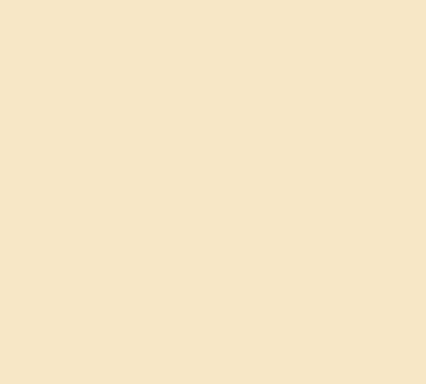
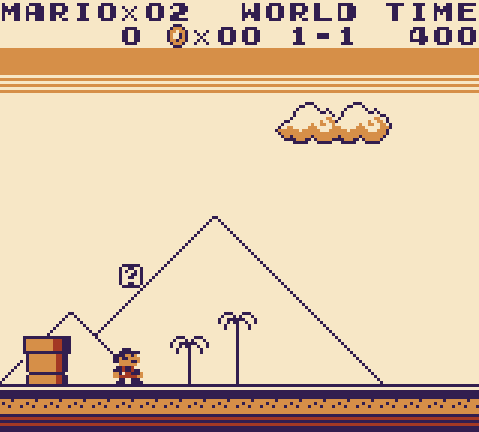
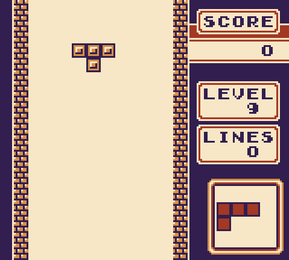

# dmg-emulator
Original gameboy emulator written in c++ using sdl2. Current performance is ~1.8K fps.






## Dependencies
```cmake
find_package(SDL2 REQUIRED)
```

## Test roms status
|Test rom|Status|
|:-------|:-----|
|blargg's/cpu_instrs|Pass|
|blargg's/instr_timing|Pass|
|mooneye-gb/mbc1|Pass|
|mooneye-gb/mbc3|Pass|
|mooneye-gb/mbc5|Pass|

## Work in progress
* cycle accurate
* audio fixes
* save files
* pixel fifo
* user interface

